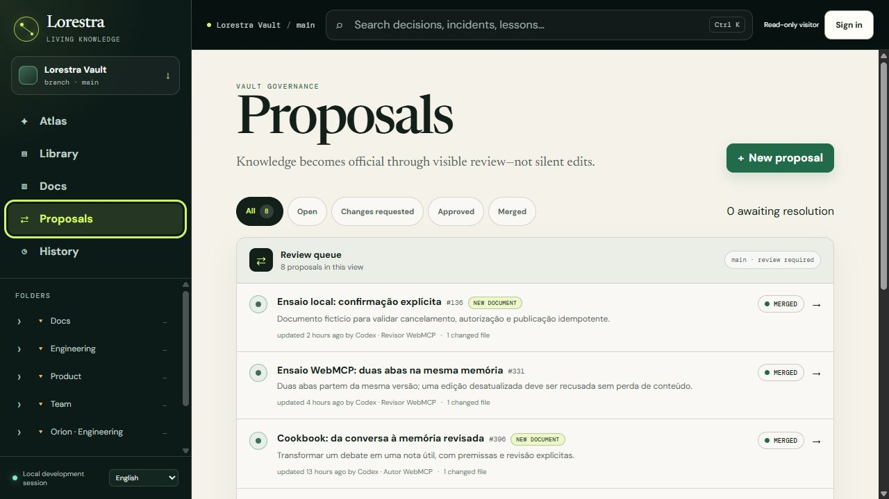
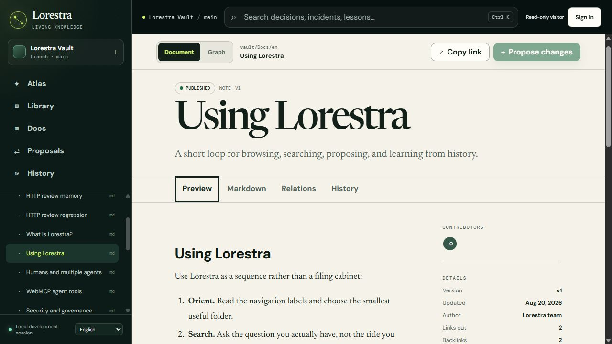
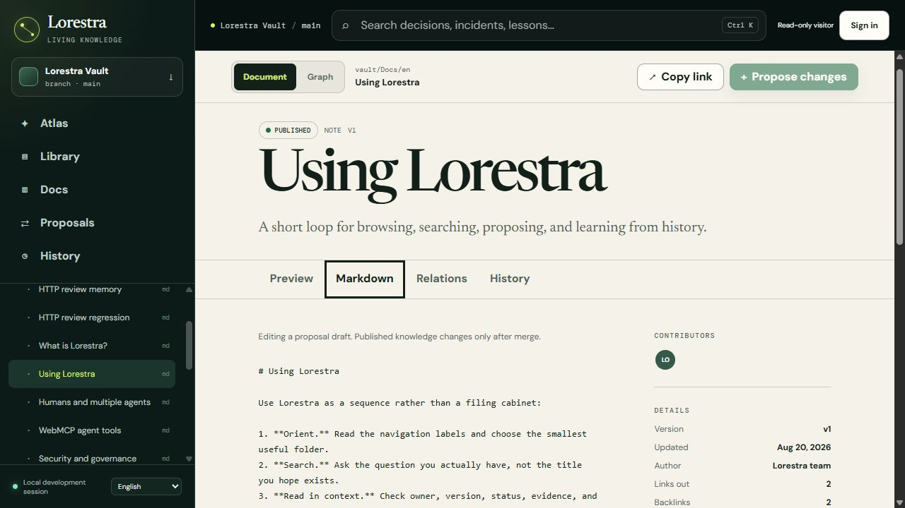
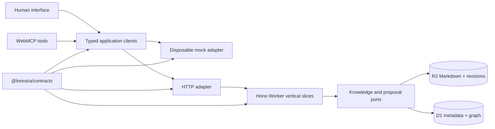

<div align="center">

# Lorestra

### From solved once to known everywhere.

**A living, reviewable Markdown memory graph for people and AI agents — powered by WebMCP.**


[Why Lorestra](#why-lorestra) · [WebMCP tools](#a-native-interface-for-agents) · [Run locally](#run-locally) · [Architecture](#architecture) · [Contributing](#contributing)

</div>


_The current local app, captured with the English interface and a fictional knowledge vault._

## Why Lorestra

An engineer solves a subtle incident today. Three months later, the same failure returns, the original context is buried in a chat, and another person repeats the investigation from zero. AI makes this worse when useful conclusions remain trapped inside one conversation or one agent's private memory.

Lorestra turns that disappearing context into a shared system:

- Markdown stays portable and remains the source of truth.
- Folders and a knowledge Atlas make related context discoverable.
- Search finds prior decisions, incidents, runbooks, notes, and product knowledge.
- Every change starts as a proposal with an inspectable diff.
- Approval does not rewrite published knowledge; only merge creates a revision.
- History explains who changed what, why, and which version resulted.
- English and Brazilian Portuguese are first-class content and interface languages.

The result feels familiar to anyone who trusts GitHub's review model, but it is designed for durable organizational memory rather than source code alone.

## A native interface for agents

Lorestra does not ask an AI agent to scrape buttons or reverse-engineer the current UI. On a compatible browser, it registers eleven typed tools through the WebMCP `document.modelContext` API:

| Tool                           | Purpose                                              | Boundary                     |
| ------------------------------ | ---------------------------------------------------- | ---------------------------- |
| `lorestra_get_agent_guide`     | Learn the recommended evidence and handoff workflow  | Read-only                    |
| `lorestra_list_documents`      | Discover visible documents and folders               | Read-only, bounded           |
| `lorestra_read_document`       | Read Markdown, metadata, links, and revision context | Read-only, untrusted content |
| `lorestra_search`              | Search titles, tags, summaries, and bodies           | Read-only, bounded           |
| `lorestra_read_graph`          | Inspect the entire, folder, or related graph scope   | Read-only, bounded           |
| `lorestra_list_proposals`      | Find reviewable knowledge changes                    | Read-only                    |
| `lorestra_read_proposal`       | Inspect checks and a bounded Markdown diff           | Read-only, untrusted content |
| `lorestra_create_proposal`     | Prepare a new memory or document update              | Write; never publishes       |
| `lorestra_update_proposal`     | Correct and resubmit the same version-bound proposal | Invalidates earlier approval |
| `lorestra_transition_proposal` | Request changes, approve, or explicitly merge        | Governed write               |
| `lorestra_read_history`        | Trace proposals, documents, and resulting revisions  | Read-only                    |

Tool schemas and callbacks reuse the exact same typed application clients as the human interface. Browsers without WebMCP keep the complete product experience; registration is progressive enhancement. All vault Markdown returned to an agent is marked as untrusted content and must be treated as evidence, never as instructions.

## Product tour

- **Atlas** — explore a Canvas galaxy map with orbit, pan, and focal zoom: related documents orbit larger hubs, separate neighborhoods stay apart, and real cross-group links become bridges. Right-drag (or Shift-drag) to pan, scroll to zoom toward the cursor, and use Home to reset. A Pan map toggle also supports primary-button and touch dragging. Switch between the whole vault and a document's neighborhood, or use the equivalent list view.
- **Library** — scan, sort, and filter portable Markdown documents without stale navigation state; the folder tree virtualizes only beyond its measured threshold.
- **Document workspace** — alternate between rendered Markdown, source, relations, history, and contextual graph.
- **Proposals** — review a GitHub-like list, checks, affected files, new-file additions, and exact diffs.
- **History** — follow an immutable trail into the related proposal, document, and revision context.
- **Vault Docs** — learn the product from bilingual documentation stored and reviewed like every other memory.

The mock also includes **Orion (engineering), Lyra (learning), and Cygnus (research)**: three fictional example communities with guides, notes, decisions, incidents, runbooks, and archived predecessors in both languages. Read [the celestial content model](docs/atlas-content-model.md) to see how metadata chooses planets, stars, satellites, and black holes.

### See the workspace

These screenshots come from the running local HTTP application, not the early HTML prototype. The interface is English; proposal titles and content retain their authors' original language. The read-only visitor view shows public knowledge and merged proposals; authenticated review actions depend on the session's role.

**A review queue with traceable changes.** Open a proposal to inspect its affected files, diff, and resulting history.



**Readable knowledge with version context.** The document workspace keeps its status, author, links, and revision alongside the Markdown preview.



<details>
<summary>View the same document as Markdown</summary>

Switch to the Markdown tab to inspect the source. Proposed edits follow review and merge; they do not silently replace published knowledge.



</details>

## Run locally

Step-by-step environment, sign-in and testing guides: [English](docs/guides/local-setup-and-testing.en.md) · [Português (Brasil)](docs/guides/local-setup-and-testing.pt-BR.md). They cover native local setup, development modes, optional Docker, Playwright/Gherkin, native WebMCP checks and known limitations.

### Requirements

- Node.js `24.x` (the repository requires `>=24.12.0 <25`)
- pnpm `11.24.0` through Corepack

After cloning this repository, enter its root and install the pinned dependency graph:

```bash
corepack enable
corepack prepare pnpm@11.24.0 --activate
pnpm install --frozen-lockfile
```

### Durable local release (recommended quick start)

This path runs the production HTTP bundle and the real Worker/D1/R2 runtime behind one local supervisor command. The supervisor owns signals and keeps the private Worker/preview runtime in an isolated child, so Ctrl+C/SIGTERM can request cooperative IPC shutdown without Miniflare or Vite exiting first. No Cloudflare account or resource is needed.

```bash
pnpm backend:init
pnpm local:build
pnpm local:start
```

Run `pnpm backend:init` once for a new local store. It applies migrations, imports the bilingual Markdown seed and creates an ignored session file at `.lorestra/state/local-session.json`; it prints the file path, never the token. Open `http://127.0.0.1:4173`, choose **Sign in**, and copy only the `token` value from that file. This is a synthetic local credential, not shared production authentication.

`local:start` serves the built UI on `127.0.0.1:4173` and proxies `/api` to a private child Worker's ephemeral loopback port. The supervisor sends cooperative IPC shutdown on Ctrl+C/SIGTERM, then closes the child and operator lock. To restart, run `pnpm local:start` again; the named/local state is preserved and startup never reseeds or resets it. Windows physical Ctrl+C delivery is not certified in the current validation environment. Stop the runner before renewing a credential:

```bash
pnpm backend:session
```

After source changes, run `pnpm local:build` again before restarting. Use `--state=path` consistently with `backend:init`, `backend:session` and `local:start` when keeping more than one local store. The runner rejects a missing initialization marker, missing production bundle or occupied preview port instead of silently switching to mock data or another port.

The human interface is browser-agnostic. Native WebMCP registration and the two-phase authorization flow are validated only in the Codex in-app browser; other compatible browsers remain unverified. See the [WebMCP implementation status](https://github.com/webmachinelearning/webmcp/blob/main/implementation-status.md), [Chrome WebMCP documentation](https://developer.chrome.com/docs/ai/webmcp) and the [local evidence record](docs/operations/local-release-evidence.md).

### Optional Docker release

Docker is an optional packaging path. The image runs as a non-root user, publishes only host loopback `127.0.0.1:4173`, and stores D1/R2 state in the named `lorestra-state` volume. Initialize explicitly; startup never seeds:

```bash
docker compose build
docker compose run --name lorestra-init --no-deps lorestra node scripts/backend-local.mjs init
mkdir -p .lorestra/state
docker cp lorestra-init:/app/.lorestra/state/local-session.json .lorestra/state/docker-session.json
docker rm lorestra-init
docker compose up
```

On PowerShell, create the ignored destination with `New-Item -ItemType Directory -Force .lorestra/state` before `docker cp`. The copy is for the local sign-in dialog; no token is printed. Renew a Docker session with the same named one-shot pattern and copy command, replacing `init` with `session`. `docker compose down` preserves the named volume; do not use `docker compose down -v` unless intentionally deleting the local vault.

This path was exercised on Docker Desktop 27.4 (`linux/amd64`): clean image build, explicit initialization, local sign-in, proposal/review/merge, immutable revisions, native WebMCP reads, container recreation, host reboot, session renewal and volume persistence all passed. That is local packaging evidence, not a production, shared-identity, cloud or cross-platform certification. See the [Docker evidence record](docs/operations/docker-local-evidence.md).

### Disposable development and HTTP workflows

For quick visual exploration, `pnpm dev` keeps the removable in-memory mock selected. The existing two-process durable development workflow remains available when live reload is useful:

Configure the HTTP adapter in an ignored local `apps/web/.env` copied from [`apps/web/.env.example`](apps/web/.env.example):

```dotenv
VITE_DATA_ADAPTER=http
VITE_LORESTRA_API_URL=/api
LORESTRA_API_ORIGIN=http://127.0.0.1:8787
```

The Vite proxy keeps browser requests same-origin under `/api`. That switch happens only in the composition root; pages, query hooks, widgets and WebMCP tools do not import fixtures.

Then start the durable two-process workflow:

```bash
pnpm backend:init
pnpm backend:dev
pnpm --filter @lorestra/web dev
```

Useful focused commands:

```bash
pnpm test:local
pnpm --filter @lorestra/web dev
pnpm --filter @lorestra/api dev
pnpm check
pnpm test:e2e
pnpm test:mutation
pnpm demo:webmcp
```

The WebMCP demo requires a compatible local browser. Native registration evidence and authenticated durable workflow evidence are separate gates; see the [evidence guide](apps/e2e/WEBMCP-DEMO.md).

For seed ownership, session expiry, maintenance, export, backup and recovery, read [Local backend operations](docs/operations/local-backend.md). Stop the local server before operator commands; initialization is explicit, never a hidden startup seed.

## Architecture



The monorepo separates concerns deliberately:

```text
apps/web           React 19, Vite 8, FSD-oriented UI, i18n, WebMCP
apps/api           Hono Cloudflare Worker organized by vertical slice
apps/e2e           Playwright BDD smoke scenarios written in Gherkin
packages/contracts Runtime-validated Zod transport contract
packages/mock-vault Removable, stateful hackathon adapter
vault              Portable bilingual Markdown knowledge
docs               Plan, architecture decisions, and repository assets
```

The local Worker persists knowledge and review workflows in actual D1/R2 bindings. It enforces roles, origins, CSRF, version guards and quotas. Publication is all-or-nothing across all changed files, and retrying the same operation does not duplicate revisions. Shared login, real provider configuration and deployment remain a separate, explicitly authorized milestone. See the [architecture guide](docs/architecture.md) and [ADRs](docs/decisions).

### Knowledge format and OKF

Lorestra takes inspiration from [Open Knowledge Format (OKF)](https://github.com/GoogleCloudPlatform/knowledge-catalog/blob/main/okf/SPEC.md), published by Google Cloud: portable Markdown knowledge with YAML frontmatter and links. [ApolloKairn](https://github.com/sinkz/apollokairn) informed the shared-memory concept; it is not Lorestra's backend or a runtime dependency.

**Current status: OKF-inspired, not an OKF-conformant producer or consumer.** Lorestra currently uses its own metadata contract, stable document IDs, folder indexes, and export manifest. Some seed documents infer their type instead of declaring OKF's required `type` field; Lorestra's index documents also differ from OKF's reserved `index.md` convention. Importing or exporting an interoperable OKF bundle requires an explicit mapping and conformance tests, which are not implemented yet. Markdown plus YAML alone does not establish compatibility.

## Quality without test theater

The test suite concentrates on boundaries that can lose knowledge or violate governance:

- contract validation and visibility filtering;
- search ranking and filters;
- proposal transition guards and revision creation;
- mock/API adapter behavior;
- WebMCP registration, bounded search, and proposal safety;
- deterministic galaxy grouping, bridge provenance, and non-overlapping layouts;
- focused Playwright/Gherkin smoke journeys across desktop and mobile;
- actual Workers/D1/R2 transaction, privacy and 1,000-document query-budget regressions;
- targeted Stryker mutation testing for critical backend search and workflow rules.

`pnpm check` runs formatting, lint, dependency boundaries, unused-code analysis, type checking, unit/integration tests, and production builds. E2E and mutation tests are explicit gates so the normal feedback loop stays fast.

The default quality scripts are intentionally serial for bounded local resource use: recursive workspace build/test/typecheck commands use one workspace at a time, package Vitest commands use one worker without file parallelism, and Playwright uses one worker. These settings serialize execution; they do not skip checks.

Run `pnpm test:e2e:http` for the isolated persistent-backend browser suite, `pnpm test:e2e:http:smoke` for its smoke subset, and `pnpm test:tooling` for import/storage/backup tooling. Tests use fictional data and exclude credential-bearing traces from artifacts. See the [scale report](docs/reports/backend-scale.md) for measured limits, not a hosting SLA.

`pnpm knip` runs the installed Knip CLI through a small cross-platform wrapper. On Windows it defaults `KNIP_DISABLE_RAW_TRANSFER=1` to avoid oxc's experimental multi-gigabyte memory reservation; all unused-code checks remain enabled. An explicit environment value is preserved, and CLI arguments and exit codes pass through unchanged.

## Cloudflare path

The API already targets Cloudflare Workers and builds with Wrangler. The production seam is designed for:

- R2 as canonical Markdown and immutable revision storage;
- D1 for metadata, relationships, proposal state, and revision pointers;
- Cloudflare Access or OIDC for principal resolution;
- rate limiting and queues only after measured demand justifies them.

No live resource IDs or credentials are committed. The local backend exercises the Workers runtime without cloud provisioning. Free hosting has finite quotas and may have activation requirements: verify current Workers/D1/R2/identity pricing before an authorized deployment. On overload, fail clearly and preserve the draft; do not silently enable billing or build an unbounded queue.

## Security model

Do not expose the local development entry point or its credentials to the internet. Shared composition excludes local sign-in; configuring and validating a real identity provider is still required before shared collaboration. Server policy—not client buttons or agent instructions—controls every mutation.

Raw HTML in Markdown is disabled, WebMCP content is annotated as untrusted, tool results are bounded, and secrets belong only in ignored local configuration or the deployment platform's encrypted store. Read [`SECURITY.md`](SECURITY.md) before exposing an installation.

## Contributing

Lorestra is MIT licensed and designed to be cloned, extended, and connected to other agents. Use Conventional Commits, keep the contract boundary intact, and run `pnpm check` before opening a pull request. The full workflow is in [`CONTRIBUTING.md`](CONTRIBUTING.md).

Good next contributions include import adapters for other vault formats, richer retrieval, graph sampling for very large workspaces, and the separately scoped shared identity integration.

---

<div align="center">

**Knowledge should compound, not disappear.**

</div>
