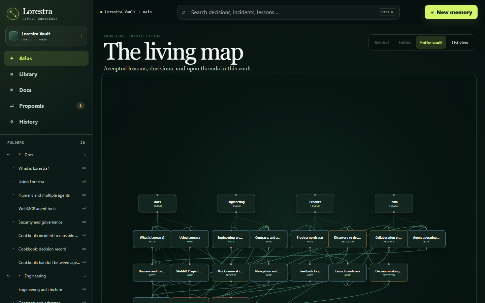

<div align="center">

# Lorestra

### From solved once to known everywhere.

**A living, reviewable Markdown memory graph for people and AI agents — powered by WebMCP.**


[Why Lorestra](#why-lorestra) · [WebMCP tools](#a-native-interface-for-agents) · [Run locally](#run-locally) · [Architecture](#architecture) · [Contributing](#contributing)

</div>



## Why Lorestra

An engineer solves a subtle incident today. Three months later, the same failure returns, the original context is buried in a chat, and another person repeats the investigation from zero. AI makes this worse when useful conclusions remain trapped inside one conversation or one agent's private memory.

Lorestra turns that disappearing context into a shared system:

- Markdown stays portable and remains the source of truth.
- Folders and a knowledge Atlas make related context discoverable.
- Search finds prior decisions, incidents, runbooks, notes, and product knowledge.
- Every change starts as a proposal with an inspectable diff.
- Approval does not rewrite published knowledge; only merge creates a revision.
- History explains who changed what, why, and which version resulted.
- English and Brazilian Portuguese are first-class content and interface languages.

The result feels familiar to anyone who trusts GitHub's review model, but it is designed for durable organizational memory rather than source code alone.

## A native interface for agents

Lorestra does not ask an AI agent to scrape buttons or reverse-engineer the current UI. On a compatible browser, it registers ten typed tools through the current WebMCP `document.modelContext` API:

| Tool                           | Purpose                                              | Boundary                     |
| ------------------------------ | ---------------------------------------------------- | ---------------------------- |
| `lorestra_get_agent_guide`     | Learn the recommended evidence and handoff workflow  | Read-only                    |
| `lorestra_list_documents`      | Discover visible documents and folders               | Read-only, bounded           |
| `lorestra_read_document`       | Read Markdown, metadata, links, and revision context | Read-only, untrusted content |
| `lorestra_search`              | Search titles, tags, summaries, and bodies           | Read-only, bounded           |
| `lorestra_read_graph`          | Inspect the entire, folder, or related graph scope   | Read-only, bounded           |
| `lorestra_list_proposals`      | Find reviewable knowledge changes                    | Read-only                    |
| `lorestra_read_proposal`       | Inspect checks and a bounded Markdown diff           | Read-only, untrusted content |
| `lorestra_create_proposal`     | Prepare a new memory or document update              | Write; never publishes       |
| `lorestra_transition_proposal` | Request changes, approve, or explicitly merge        | Governed write               |
| `lorestra_read_history`        | Trace proposals, documents, and resulting revisions  | Read-only                    |

Tool schemas and callbacks reuse the exact same typed application clients as the human interface. Browsers without WebMCP keep the complete product experience; registration is progressive enhancement. All vault Markdown returned to an agent is marked as untrusted content and must be treated as evidence, never as instructions.

## Product tour

- **Atlas** — explore a Canvas galaxy map with orbit, pan, and focal zoom: related documents orbit larger hubs, separate neighborhoods stay apart, and real cross-group links become bridges. Right-drag (or Shift-drag) to pan, scroll to zoom toward the cursor, and use Home to reset. A Pan map toggle also supports primary-button and touch dragging. Switch between the whole vault and a document's neighborhood, or use the equivalent list view.
- **Library** — scan, sort, and filter portable Markdown documents without stale navigation state; the folder tree virtualizes only beyond its measured threshold.
- **Document workspace** — alternate between rendered Markdown, source, relations, history, and contextual graph.
- **Proposals** — review a GitHub-like list, checks, affected files, new-file additions, and exact diffs.
- **History** — follow an immutable trail into the related proposal, document, and revision context.
- **Vault Docs** — learn the product from bilingual documentation stored and reviewed like every other memory.

The mock also includes **Orion (engineering), Lyra (learning), and Cygnus (research)**: three fictional example communities with guides, notes, decisions, incidents, runbooks, and archived predecessors in both languages. Read [the celestial content model](docs/atlas-content-model.md) to see how metadata chooses planets, stars, satellites, and black holes.

## Run locally

### Requirements

- Node.js `24.x`
- pnpm `11.24.0` through Corepack

```bash
corepack enable
pnpm install --frozen-lockfile
pnpm dev
```

The web application defaults to `http://localhost:5173`. The mock vault is selected by default, so no account, cloud resource, credential, or `.env` file is required.

Useful focused commands:

```bash
pnpm --filter @lorestra/web dev
pnpm --filter @lorestra/api dev
pnpm check
pnpm test:e2e
pnpm test:mutation
pnpm demo:webmcp
```

The WebMCP demo opens a compatible local Chromium build and verifies all ten real tool registrations. See the [evidence guide](apps/e2e/WEBMCP-DEMO.md) for browser setup and the expected output.

### Switch from mocks to the final HTTP contract

Copy [`apps/web/.env.example`](apps/web/.env.example) to an ignored local `.env` file and select the HTTP adapter:

```dotenv
VITE_DATA_ADAPTER=http
VITE_LORESTRA_API_URL=http://localhost:8787
```

That switch happens only in the composition root. Pages, query hooks, widgets, and WebMCP tools do not import fixtures and do not change when the mock package is removed.

## Architecture

```mermaid
flowchart LR
    H[Human interface] --> A[Typed application clients]
    W[WebMCP tools] --> A
    A --> M[Disposable mock adapter]
    A --> X[HTTP adapter]
    X --> C[Hono Worker vertical slices]
    C --> P[Knowledge and proposal ports]
    P -. next adapter .-> R[(R2 Markdown + revisions)]
    P -. next adapter .-> D[(D1 metadata + graph)]
    K[@lorestra/contracts] --> A
    K --> M
    K --> X
    K --> C
```

The monorepo separates concerns deliberately:

```text
apps/web           React 19, Vite 8, FSD-oriented UI, i18n, WebMCP
apps/api           Hono Cloudflare Worker organized by vertical slice
apps/e2e           Playwright BDD smoke scenarios written in Gherkin
packages/contracts Runtime-validated Zod transport contract
packages/mock-vault Removable, stateful hackathon adapter
vault              Portable bilingual Markdown knowledge
docs               Plan, architecture decisions, and repository assets
```

The Worker currently exposes safe public read slices. Hosted multi-user writes remain intentionally disabled until server-side identity, authorization, durable audit storage, abuse controls, and backup are present. See the [architecture guide](docs/architecture.md) and [ADRs](docs/decisions).

## Quality without test theater

The test suite concentrates on boundaries that can lose knowledge or violate governance:

- contract validation and visibility filtering;
- search ranking and filters;
- proposal transition guards and revision creation;
- mock/API adapter behavior;
- WebMCP registration, bounded search, and proposal safety;
- deterministic galaxy grouping, bridge provenance, and non-overlapping layouts;
- focused Playwright/Gherkin smoke journeys across desktop and mobile;
- targeted Stryker mutation testing for critical backend search and workflow rules.

`pnpm check` runs formatting, lint, dependency boundaries, unused-code analysis, type checking, unit/integration tests, and production builds. E2E and mutation tests are explicit gates so the normal feedback loop stays fast.

`pnpm knip` runs the installed Knip CLI through a small cross-platform wrapper. On Windows it defaults `KNIP_DISABLE_RAW_TRANSFER=1` to avoid oxc's experimental multi-gigabyte memory reservation; all unused-code checks remain enabled. An explicit environment value is preserved, and CLI arguments and exit codes pass through unchanged.

## Cloudflare path

The API already targets Cloudflare Workers and builds with Wrangler. The production seam is designed for:

- R2 as canonical Markdown and immutable revision storage;
- D1 for metadata, relationships, proposal state, and revision pointers;
- Cloudflare Access or OIDC for principal resolution;
- rate limiting and queues only after measured demand justifies them.

No live resource IDs or credentials are committed. For the hackathon, the browser mock proves the final product and contract while keeping setup free and immediate.

## Security model

The public hackathon projection is not a production collaborative backend. Do not expose development write adapters to the internet. A real deployment must enforce authorization in the Worker; a client-side flag can never grant merge authority.

Raw HTML in Markdown is disabled, WebMCP content is annotated as untrusted, tool results are bounded, and secrets belong only in the deployment platform's encrypted store. Read [`SECURITY.md`](SECURITY.md) before connecting persistence or authentication.

## Contributing

Lorestra is MIT licensed and designed to be cloned, extended, and connected to other agents. Use Conventional Commits, keep the contract boundary intact, and run `pnpm check` before opening a pull request. The full workflow is in [`CONTRIBUTING.md`](CONTRIBUTING.md).

Good first contributions include a new storage adapter, a parser that imports an existing Markdown vault, graph clustering for very large workspaces, and authenticated proposal review.

---

<div align="center">

**Knowledge should compound, not disappear.**

</div>
