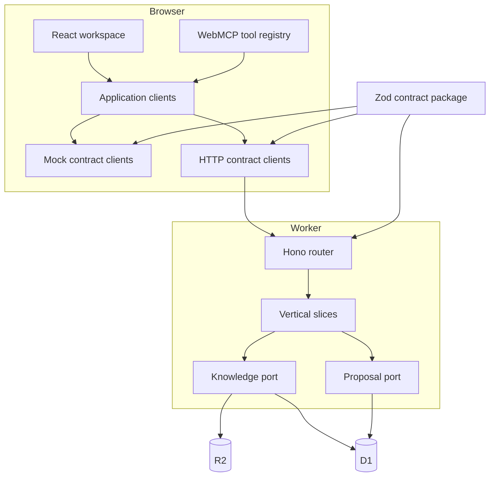

# Lorestra architecture

Lorestra has two equally important consumers: a person using the React workspace and an agent invoking WebMCP tools. Both depend on the same application-client seam. This is the central constraint that keeps the hackathon mock disposable and prevents the agent surface from becoming a second product.

## Runtime shape



## Browser boundaries

The composition root is the only module that selects mock or HTTP contract clients. Adapters map those contract DTOs into small UI-facing models. TanStack Query owns remote state; Zustand owns only shell preferences such as language and folder disclosure; route parameters own durable selection and filters.

The UI follows Feature-Sliced Design dependency direction: shared code cannot import widgets or pages, widgets compose shared capabilities, pages compose routes, and the app layer wires providers. The large graph renderer is route-lazy. Folder and library lists activate virtualization only above explicit thresholds, keeping small vaults semantically simple.

## Agent boundary

The WebMCP feature registers eleven imperative tools with `document.modelContext.registerTool()`, including update/resubmit. A single `AbortController` owns their page lifecycle. Read tools declare `readOnlyHint`; tools returning vault or proposal content declare `untrustedContentHint`. Writes use the same mutation coordinator, idempotency keys and cache invalidation as the UI. The agent guide exposes current capabilities and storage limits but never a session credential.

The registration layer is optional at runtime. An unsupported browser gets no exception and no degraded human interface. Inputs are constrained by JSON Schema and checked again at execution. Body, list, history, diff, and graph outputs have explicit limits.

## Worker boundaries

The Hono Worker is organized by use case instead of horizontal controllers and services. Each vertical slice owns route registration, transport mapping, its use case, and integration coverage. Shared knowledge and proposal modules expose ports; adapters implement those ports without leaking Cloudflare storage types into the contract.

The durable composition registers read-vault, manage-proposals and manage-session slices. Their declarative request/response schemas also generate `/api/openapi.json`; authentication, bounded JSON streaming, request quotas and typed errors surround each slice. The legacy memory composition remains an explicit test scaffold, not the Worker entry point.

Both local and shared compositions use persistent D1/R2 adapters. Local composition additionally registers a token exchange for pre-created synthetic operator sessions. Shared composition does not register that endpoint; a real provider login is a separate milestone. A cookie, CSRF token and UI capability do not replace server-side role and publication guards. See ADR-0006 and ADR-0007.

## Published knowledge invariant

```text
draft proposal -> review -> approved proposal -> merge -> immutable revision
```

Creating or approving a proposal does not change the document returned by the read client. Editing reopens the same proposal and clears its approval. Merge prepares immutable R2 bodies, then commits document pointers, metadata, links, revision snapshots, proposal state, audit events and the idempotent result in one guarded D1 batch. Tests inject late SQL failures and races against real bindings. No global Worker mutex or asynchronous post-response publication is used.

The public read projection includes published documents and public archives. An archive is retained historical knowledge (a black hole in the Atlas), not a privacy action. Drafts and internal documents remain excluded from navigation, reads, search, graphs, and history in both adapters. See the [celestial content model](atlas-content-model.md) for the metadata mapping and fictional bilingual examples.

## Replacing the mock

1. Run `pnpm backend:init` once, then `pnpm backend:dev`.
2. Set `VITE_DATA_ADAPTER=http` and same-origin `VITE_LORESTRA_API_URL=/api` for local development.
3. Start the frontend on the configured allowed origin and sign in with the operator-created local credential.
4. Execute the persistent HTTP smoke and inspect the [local operations guide](operations/local-backend.md).

Production builds already default to HTTP and exclude the mock fixture chunk. The mock remains available only for explicit visual development and contract tests. No page-level fixture fallback exists when the real API is down.

No page, hook, widget, or WebMCP tool changes in this sequence.
