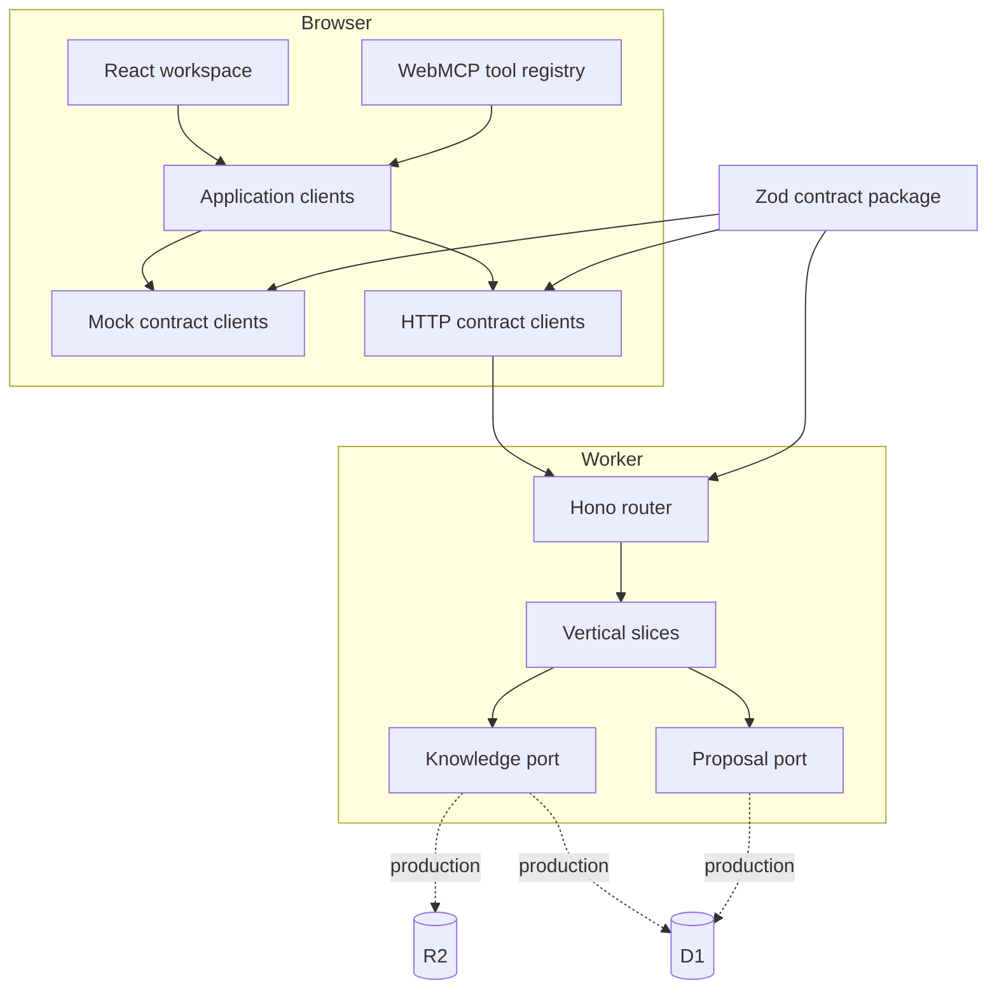

# Lorestra architecture

Lorestra has two equally important consumers: a person using the React workspace and an agent invoking WebMCP tools. Both depend on the same application-client seam. This is the central constraint that keeps the hackathon mock disposable and prevents the agent surface from becoming a second product.

## Runtime shape



## Browser boundaries

The composition root is the only module that selects mock or HTTP contract clients. Adapters map those contract DTOs into small UI-facing models. TanStack Query owns remote state; Zustand owns only shell preferences such as language and folder disclosure; route parameters own durable selection and filters.

The UI follows Feature-Sliced Design dependency direction: shared code cannot import widgets or pages, widgets compose shared capabilities, pages compose routes, and the app layer wires providers. The large graph renderer is route-lazy. Folder and library lists activate virtualization only above explicit thresholds, keeping small vaults semantically simple.

## Agent boundary

The WebMCP feature registers ten imperative tools with `document.modelContext.registerTool()`. A single `AbortController` owns their page lifecycle. Read tools declare `readOnlyHint`; tools returning vault or proposal content declare `untrustedContentHint`. Write tools create or transition proposals through the same clients used by the UI.

The registration layer is optional at runtime. An unsupported browser gets no exception and no degraded human interface. Inputs are constrained by JSON Schema and checked again at execution. Body, list, history, diff, and graph outputs have explicit limits.

## Worker boundaries

The Hono Worker is organized by use case instead of horizontal controllers and services. Each vertical slice owns route registration, transport mapping, its use case, and integration coverage. Shared knowledge and proposal modules expose ports; adapters implement those ports without leaking Cloudflare storage types into the contract.

The public Worker registers reads only. Durable writes are a future adapter and policy concern because public collaboration requires authentication, authorization, abuse control, concurrency rules, append-only audit storage, and backup. The browser mock demonstrates proposal behavior but is not a security boundary.

## Published knowledge invariant

```text
draft proposal -> review -> approved proposal -> merge -> immutable revision
```

Creating a proposal and approving it do not change the document returned by the read client. Merge is the only operation that creates a published revision. This invariant is tested at the state-machine, API, WebMCP, and browser-smoke seams.

The public read projection includes published documents and public archives. An archive is retained historical knowledge (a black hole in the Atlas), not a privacy action. Drafts and internal documents remain excluded from navigation, reads, search, graphs, and history in both adapters. See the [celestial content model](atlas-content-model.md) for the metadata mapping and fictional bilingual examples.

## Replacing the mock

1. Start the Worker and set `VITE_DATA_ADAPTER=http`.
2. Confirm the HTTP clients pass the same contract suite.
3. Connect production knowledge and proposal ports to R2/D1 adapters.
4. Add server-side identity and policy before registering write routes.
5. Remove `@lorestra/mock-vault` from the web composition root and workspace.

No page, hook, widget, or WebMCP tool changes in this sequence.
